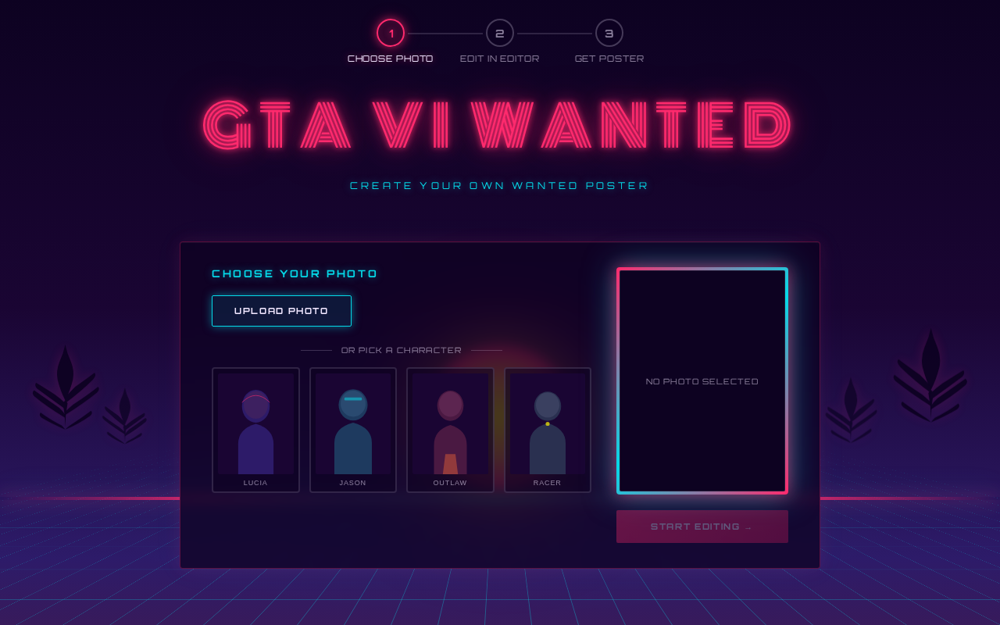

# Vice City Wanted

A GTA VI-inspired wanted-poster creator built with React and the [Unlayer React Image Editor](https://www.npmjs.com/package/@unlayer/react-image-editor). Upload a photo or pick a preset character, add neon filters and stickers in the editor, then reveal a dramatic **WANTED** poster you can download.



## Screenshots

| Choose Photo | Photo Selected | Image Editor |
| --- | --- | --- |
|  |  |  |

## Why this experience

**Vice City Wanted** is a playful, synthwave-styled demo that channels the hype around GTA VI — neon sunsets, palm trees, and over-the-top crime bounties — without being an official Rockstar product. It shows how a polished, themed creative flow can be built on top of a production-ready image editor:

1. **Choose Photo** — upload your own image or pick from preset characters.
2. **Edit in Editor** — style your mugshot with GTA-flavored filters, text, stickers, and drawing tools.
3. **Get Poster** — your edited photo animates into a full **WANTED** card with a random crime, bounty, and Vice City Police Department footer, ready to download.

The goal is to make editor integration feel like part of a real product experience, not a bare widget dropped on a page.

## How the React Image Editor is used

The app uses `@unlayer/react-image-editor` in **Step 2** via the `EditPhoto` component:

```jsx
<ImageEditor
  image={selectedImageUrl}
  options={{
    theme: 'dark',
    features: {
      imageEditor: {
        tools: {
          filter: true,
          text: true,
          stickers: true,
          draw: true,
          crop: false,
          resize: false,
          shapes: false,
          frame: false,
        },
      },
    },
  }}
  minHeight="min(600px, 55dvh)"
  onSave={({ dataUrl }) => { /* store & advance to poster */ }}
  onCancel={onBack}
/>
```

- **`image`** — the data URL or asset URL from Step 1.
- **`options.theme`** — `'dark'` to match the synthwave UI.
- **`options.features.imageEditor.tools`** — allow-list of tools; only filter, text, stickers, and draw are enabled.
- **`onSave`** — receives `{ dataUrl, blob }`; the `dataUrl` is stored in App state and passed to the poster step.
- **`onCancel`** — wired to the **← Back** button to return to photo selection.

The editor is fully unmounted when leaving Step 2 (and on **Start Over**), so each session starts with a clean instance.

## Tech stack

- **React 18** + **Vite**
- **@unlayer/react-image-editor** — embedded image editing
- **framer-motion** — page load, poster reveal, and step transitions
- **html-to-image** — export the HTML/CSS poster card as a PNG
- Plain **CSS** (CSS variables, no UI framework)

## Local setup

```bash
npm install
npm run dev
```

Open the URL shown in the terminal (default `http://localhost:5173`).

### Other scripts

```bash
npm run build    # production build → dist/
npm run preview  # preview production build
npm run lint     # oxlint
```

## Project structure

```
src/
├── components/
│   ├── ChoosePhoto.jsx   # Step 1 — upload / presets
│   ├── EditPhoto.jsx     # Step 2 — Unlayer editor
│   ├── Poster.jsx        # Step 3 — wanted poster + download
│   ├── ProgressBar.jsx
│   └── PalmTrees.jsx
├── data/
│   ├── crimes.js         # random crimes & bounties
│   └── presets.js        # preset character images
└── assets/               # character placeholder images
```

---

Built as a demo for **Vice City Wanted — Built with React Image Editor**.
