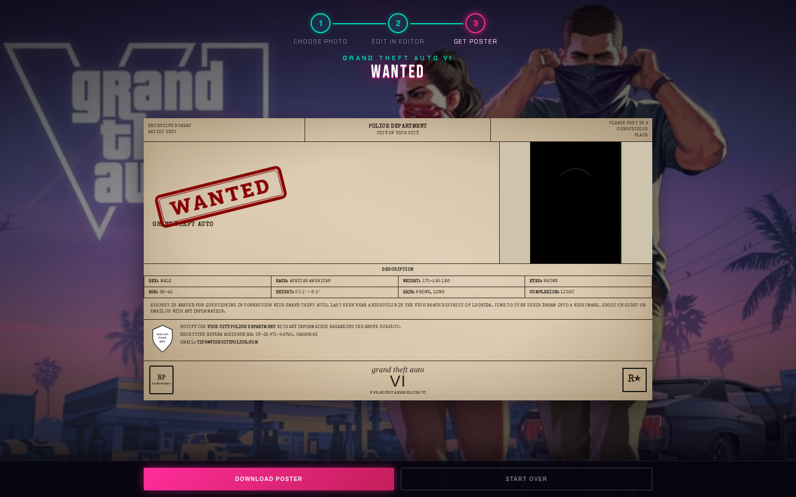
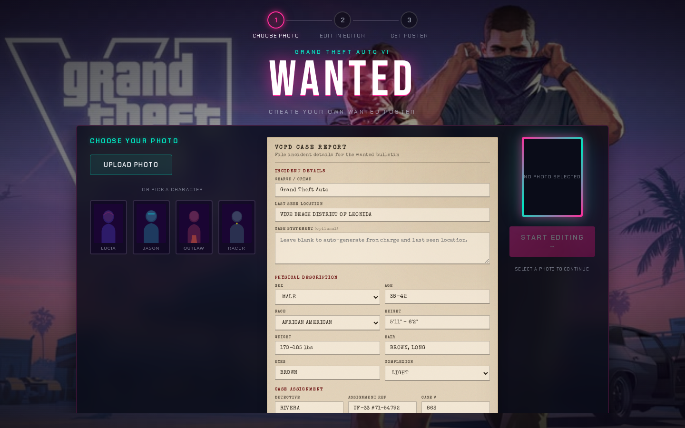
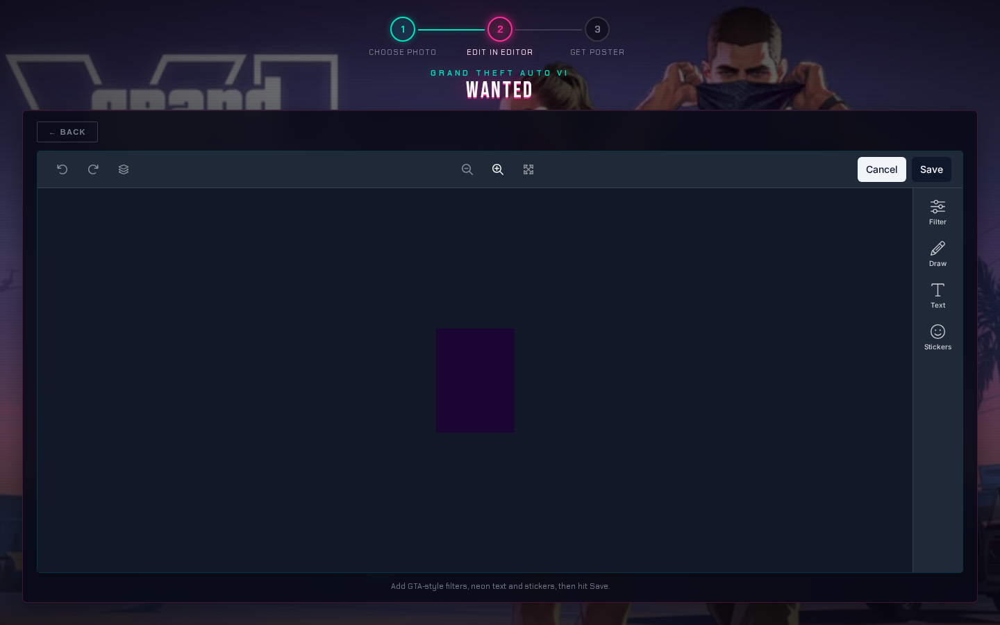
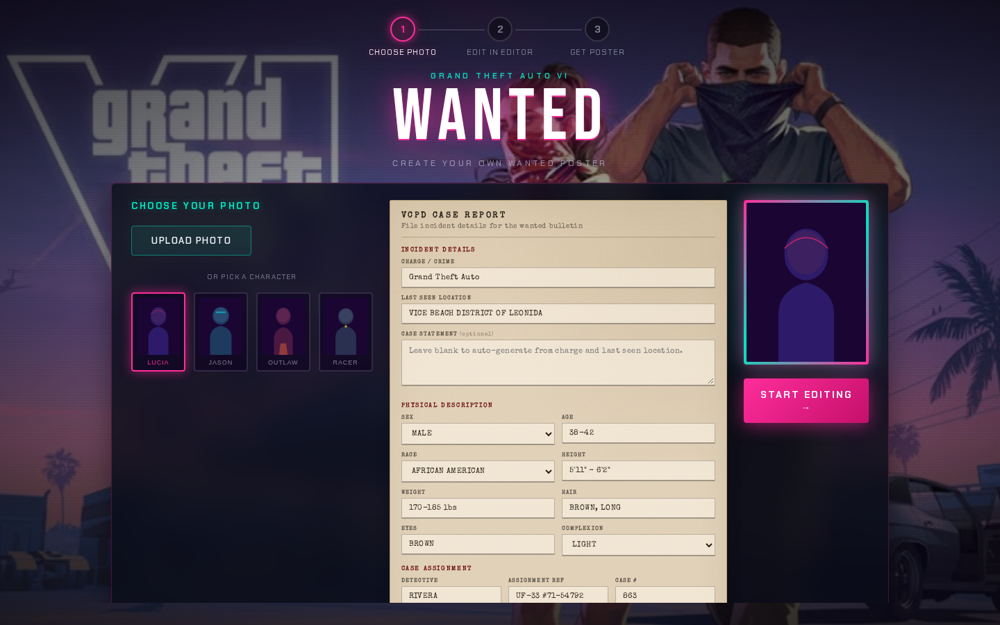

# GTA VI Wanted

Create your own **Grand Theft Auto VI**–style police wanted poster. Upload a mugshot, file a **VCPD case report**, edit your photo in the [Unlayer React Image Editor](https://www.npmjs.com/package/@unlayer/react-image-editor), then download a GTA IV–inspired LCPD bulletin as a PNG.

**[Live demo](https://unlayer-react-image-editor-gta6.vercel.app)** · Fan-made demo · Not affiliated with Rockstar Games



## The experience

A three-step flow built to feel like part of a real GTA product — not a bare editor widget dropped on a page.

### 1. Choose Photo & File Case Report

Pick your suspect photo and fill out the dossier:

- **Upload** your own image or choose a preset character (Lucia, Jason, Outlaw, Racer)
- **VCPD Case Report** — parchment-style form with:
  - Charge / crime (with GTA crime suggestions)
  - Last seen location
  - Optional custom case statement
  - Physical description (sex, age, race, height, weight, hair, eyes, complexion)
  - Detective, assignment ref, and case number



### 2. Edit in Editor

Style your mugshot with the embedded Unlayer editor — filters, text, stickers, and drawing tools on a dark theme that matches the Vice City backdrop.



### 3. Get Poster

Your edited photo and case details render into a wide **LCPD-style wanted bulletin**:

- Aged paper texture and typewriter typography
- Distressed red **WANTED** rubber-stamp
- Description grid, narrative, VCPD badge, and GTA VI branding
- **Download Poster** exports a high-res PNG
- Sticky action bar so controls stay visible while you preview


## Screenshots

| Case report | Photo selected | Image editor | Wanted poster |
| --- | --- | --- | --- |
|  |  |  |  |

## How the React Image Editor is used

The app uses `@unlayer/react-image-editor` in **Step 2** via `EditPhoto.jsx`:

```jsx
<ImageEditor
  image={selectedImageUrl}
  options={{
    theme: 'dark',
    features: {
      imageEditor: {
        tools: {
          filter: true,
          text: true,
          stickers: true,
          draw: true,
          crop: false,
          resize: false,
          shapes: false,
          frame: false,
        },
      },
    },
  }}
  minHeight="min(600px, 55dvh)"
  onSave={({ dataUrl }) => { /* store & advance to poster */ }}
  onCancel={onBack}
/>
```

- **`image`** — data URL or asset URL from Step 1
- **`options.theme`** — `'dark'` to match the cinematic GTA VI UI
- **`options.features.imageEditor.tools`** — allow-list; only filter, text, stickers, and draw are enabled
- **`onSave`** — receives `{ dataUrl, blob }`; the data URL is passed to the poster step
- **`onCancel`** — wired to **← Back** to return to the case report

The editor is fully unmounted when leaving Step 2 (and on **Start Over**), so each session starts clean.

## Tech stack

| Layer | Choice |
| --- | --- |
| Framework | React 18 + Vite |
| Image editing | [@unlayer/react-image-editor](https://www.npmjs.com/package/@unlayer/react-image-editor) |
| Motion | framer-motion |
| Poster export | html-to-image |
| Styling | Plain CSS (no UI framework) |
| Fonts | Bebas Neue, Chakra Petch, Roboto Slab, Special Elite |

## Local setup

```bash
npm install
npm run dev
```

Open the URL shown in the terminal (default `http://localhost:5173`).

### Other scripts

```bash
npm run build    # production build → dist/
npm run preview  # preview production build
npm run lint     # oxlint
```

### Refresh README screenshots

After UI changes, rebuild and capture new screenshots:

```bash
npm run build
npm run preview -- --host 127.0.0.1 --port 4173 &
npx -p playwright node scripts/capture-screenshots.mjs
```

## Deploy on Vercel

| Setting | Value |
| --- | --- |
| Framework Preset | Vite |
| Root Directory | `./` |
| Build Command | `npm run build` |
| Output Directory | `dist` |
| Install Command | `npm install` |

No environment variables required.

## Project structure

```
src/
├── components/
│   ├── ChoosePhoto.jsx    # Step 1 — photo + VCPD case report form
│   ├── EditPhoto.jsx      # Step 2 — Unlayer image editor
│   ├── Poster.jsx         # Step 3 — LCPD bulletin + PNG download
│   ├── ProgressBar.jsx
│   └── ViceCityScene.jsx  # GTA VI cinematic background
├── data/
│   ├── crimes.js          # crime suggestions for the report
│   ├── posterCopy.js      # narrative & random profile helpers
│   ├── posterReport.js    # case report defaults & validation
│   └── presets.js         # preset character images
├── assets/
│   ├── gta-vi-bg.png      # official-style backdrop art
│   └── character-*.svg    # preset mugshot placeholders
└── App.jsx                # step routing & shared state
```

## Disclaimer

This is a **fan-made demo** for educational purposes, built to showcase the Unlayer React Image Editor. It is not affiliated with, endorsed by, or sponsored by Rockstar Games or Take-Two Interactive. Grand Theft Auto and related marks are trademarks of their respective owners.

---

Built with **GTA VI Wanted — React Image Editor**
